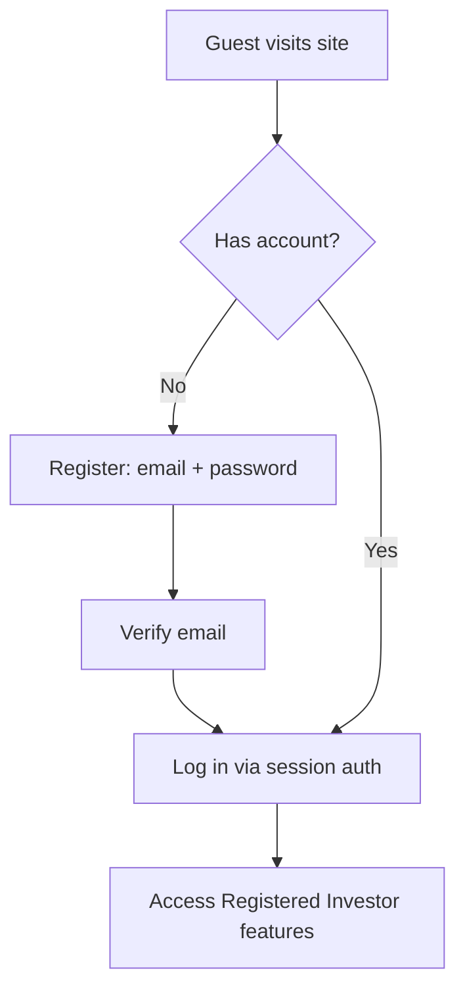
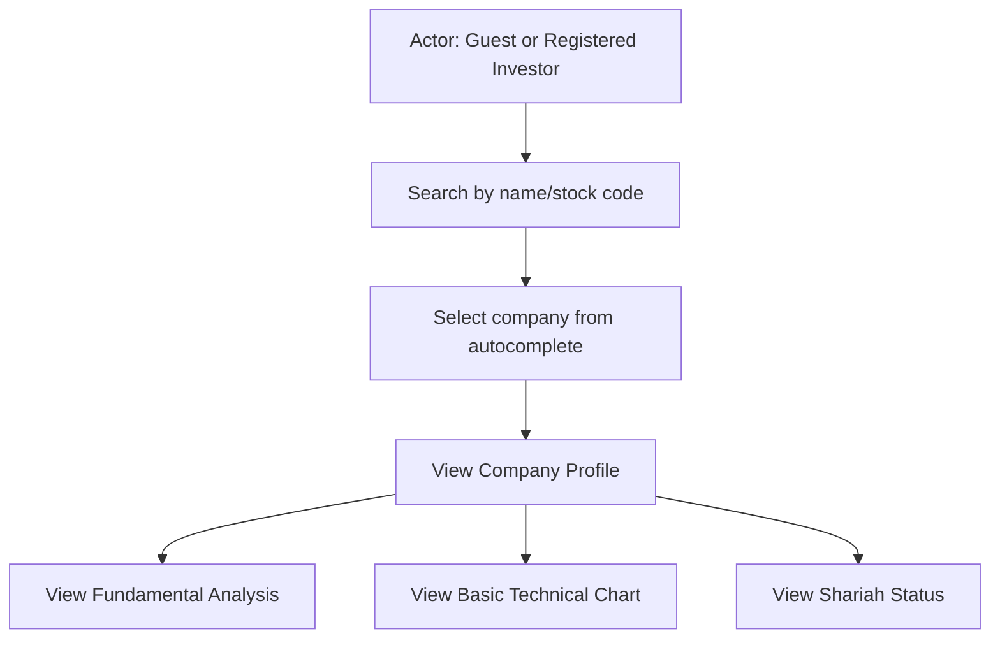
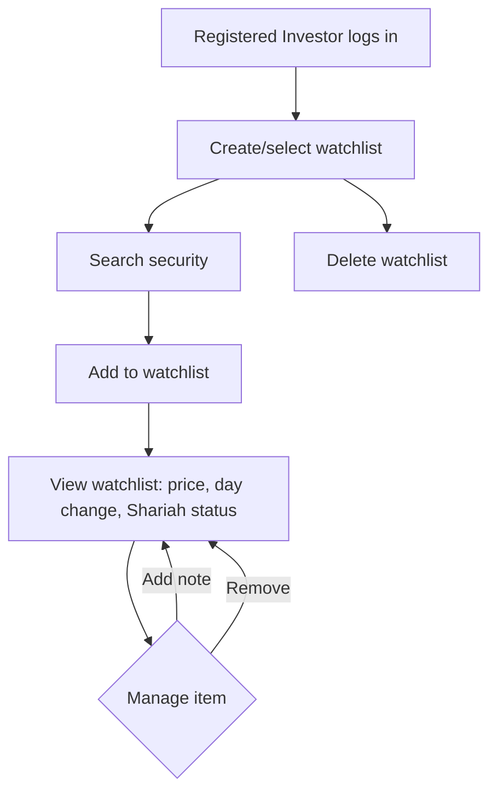
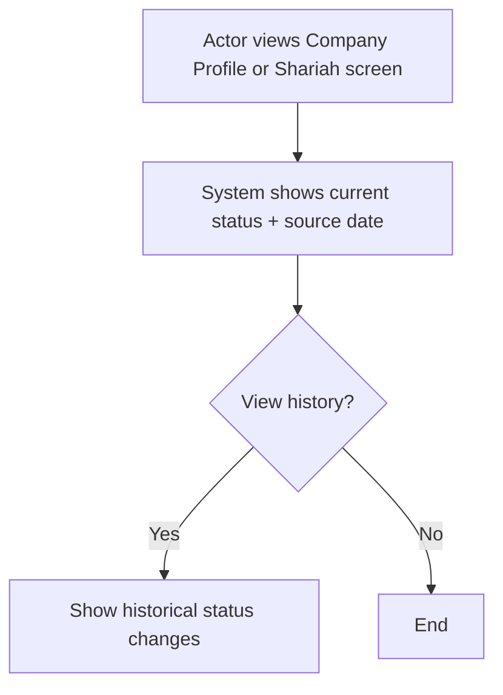
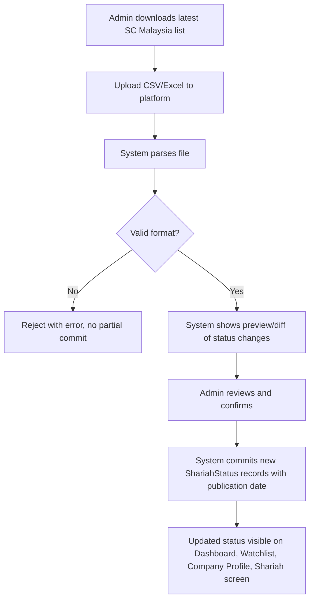

# Business Process Flows

Scope: MVP modules only. Diagrams use Mermaid syntax.

## 1. Registration & Login

## 2. Company Search & Research

## 3. Watchlist Management

## 4. Shariah Status Check (Investor)

## 5. Shariah List Import (Admin)

## Deferred Flows (Roadmap)

Alert configuration, portfolio management, stock screening workflows, and AI research
assistant conversations are not modeled here — see
[`future-enhancements-roadmap.md`](../07-roadmap/future-enhancements-roadmap.md).
