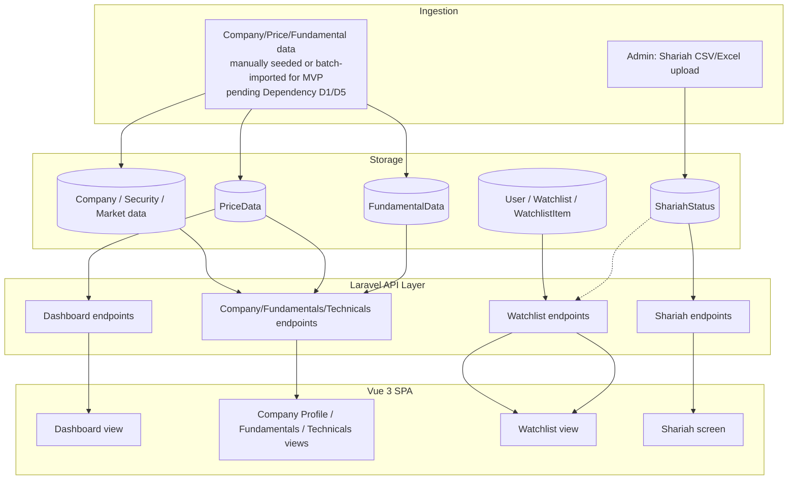

# Data Flow Diagrams (DFD)

## Level 0 — Context Diagram

Shows the full long-term ecosystem for orientation. Items in *italics* are roadmap/Phase 2+
and not built in MVP.

```mermaid
flowchart LR
    User((Guest / Registered Investor))
    Admin((Admin))
    Provider[/Market Data Provider\n**pending — Dependency D1**/]
    SC[/SC Malaysia Shariah List\nmanual download/]
    AI[/*AI Provider\n(Claude/OpenAI) — pending D2*/]
    Platform[[Share Monitoring Platform]]

    Provider -. future automated feed .-> Platform
    SC -->|manual CSV/Excel import| Platform
    User <-->|browse, search, watchlist| Platform
    Admin -->|import Shariah data, manage users/companies| Platform
    Platform -. *future AI queries* .-> AI
```

## Level 1 — MVP Data Flows



**Note:** the ingestion side (`A1`) is drawn generically because no market data provider is
contracted yet (Dependency D1). For MVP without a live provider, this may initially be a
manually seeded/imported dataset for demonstration purposes — see
[System Architecture](../04-architecture/system-architecture.md) for how ingestion is
architected to slot in a real provider later without redesign.

## Deferred Flows (Roadmap)

News ingestion, AI processing pipelines, alert dispatch (email/SMS/push/Telegram/
WhatsApp), and multi-market data flows are not modeled here — see
[`future-enhancements-roadmap.md`](../07-roadmap/future-enhancements-roadmap.md).
