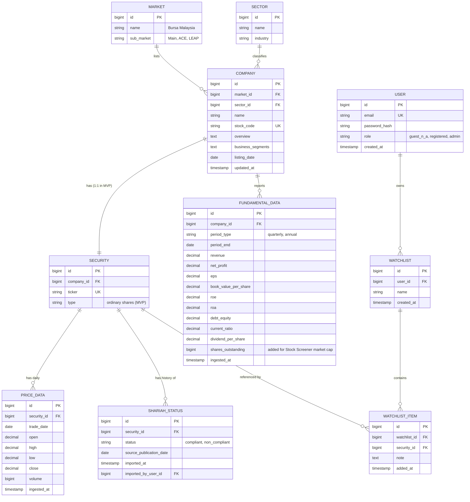
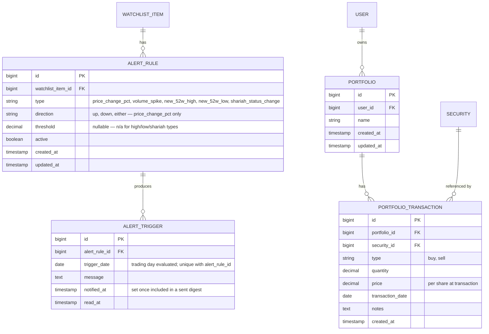

# Entity Relationship Diagram (ERD)

Scope: MVP entities, per
[`glossary-data-dictionary.md`](../00-overview/glossary-data-dictionary.md#mvp-data-entities-see-erd-for-full-detail),
plus post-MVP entities added for the Stock Screener, Watchlist Alerts, and Portfolio
Management modules (see [§ Post-MVP Additions](#post-mvp-additions) below). Remaining
deferred entities (Organization, NewsArticle, Embedding/VectorStore) are listed in the
appendix at the bottom, not modeled here.

## Diagram

## Post-MVP Additions

Stock Screener (FRS Module 7) needed no new entities — only `shares_outstanding` on
`FUNDAMENTAL_DATA`, shown above. Watchlist Alerts and Portfolio Management added these:

Notes:

- **AlertRule attaches to WatchlistItem, not Security directly** — alerts are explicitly
  "Watchlist Alerts" (FR-ALT-1); a security must already be on a watchlist to alert on it.
- **AlertTrigger is append-only with a `(alert_rule_id, trigger_date)` unique constraint**
  — prevents duplicate triggers if the daily evaluation command reruns (FR-ALT-5).
- **Portfolio holdings/cost-basis/gain-loss are computed, not stored** — derived from
  `PORTFOLIO_TRANSACTION` on every read via average cost method
  ([ADR-0010](../decisions/0010-portfolio-cost-method.md)), so there's no `PortfolioHolding`
  table.

## Notes

- **Company : Security is 1:1 in MVP** — Bursa-listed companies in scope have a single
  ordinary-share listing. Modeled as a separate entity (not merged into Company) so
  multiple security types (e.g., preferred shares, warrants) can be added later without
  restructuring Company.
- **ShariahStatus is append-only** — each SC Malaysia list import creates new rows rather
  than updating in place, preserving history (supports FR-SHR-3) and traceability to
  `imported_by_user_id` (Admin accountability for FR-SHR-5).
- **User.role** is a simple enum (`registered`, `admin`) rather than a separate roles
  table — matches the small, fixed role set in
  [role-access-tier-matrix.md](../01-requirements/role-access-tier-matrix.md); Guest is
  unauthenticated and has no User row.
- **PriceData granularity is daily (EOD)** per [ADR-0002](../decisions/0002-realtime-delivery-mechanism.md)
  — no intraday/tick table in MVP.

## Appendix: Deferred Entities (Roadmap, Not Modeled Here)

Organization/Tenant (see [ADR-0001](../decisions/0001-tenancy-model.md)), AlertChannel
(SMS/Telegram/WhatsApp — email-only for now, see [ADR-0009](../decisions/0009-email-provider.md)),
NewsArticle, Embedding/VectorStore (for AI/RAG), Tier/Subscription. These will require
schema additions when their owning modules are built.
