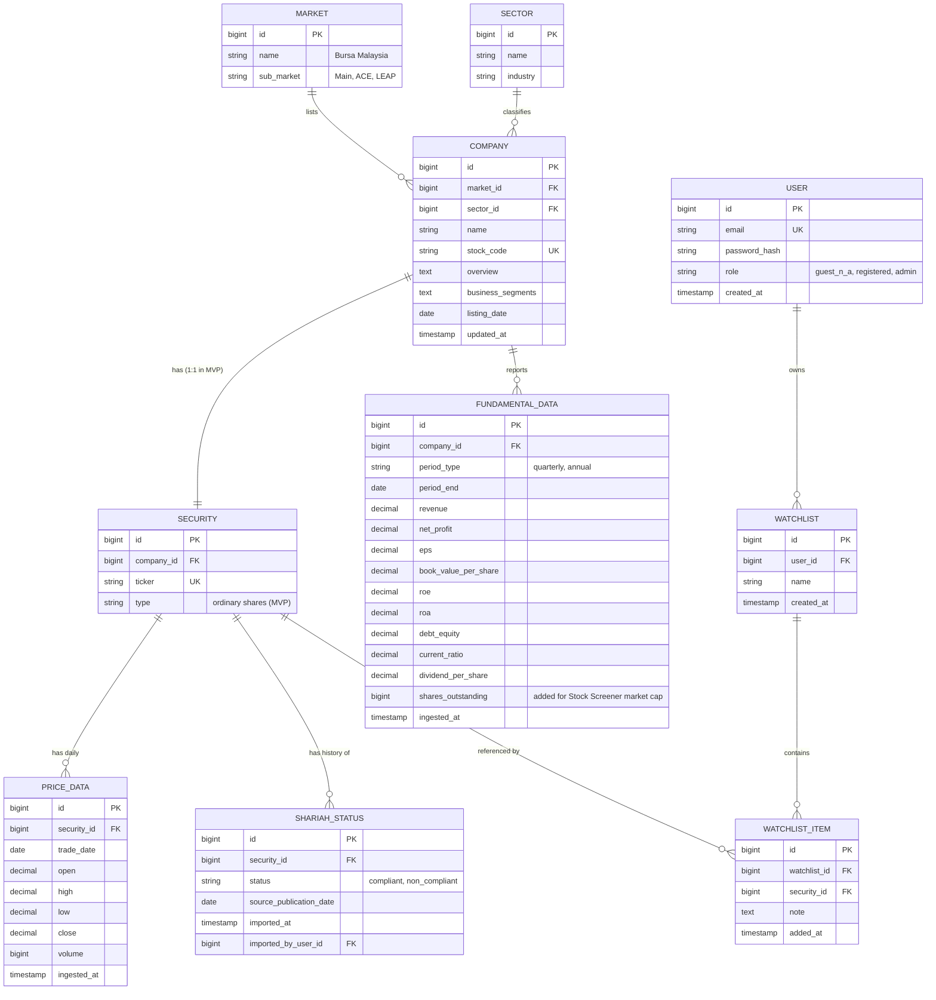

# Entity Relationship Diagram (ERD)

Scope: MVP entities only, per
[`glossary-data-dictionary.md`](../00-overview/glossary-data-dictionary.md#mvp-data-entities-see-erd-for-full-detail).
Deferred entities (Organization, Portfolio, Transaction, Alert, AlertChannel, NewsArticle,
Embedding/VectorStore) are listed in the appendix at the bottom, not modeled here.

## Diagram

## Notes

- **Company : Security is 1:1 in MVP** — Bursa-listed companies in scope have a single
  ordinary-share listing. Modeled as a separate entity (not merged into Company) so
  multiple security types (e.g., preferred shares, warrants) can be added later without
  restructuring Company.
- **ShariahStatus is append-only** — each SC Malaysia list import creates new rows rather
  than updating in place, preserving history (supports FR-SHR-3) and traceability to
  `imported_by_user_id` (Admin accountability for FR-SHR-5).
- **User.role** is a simple enum (`registered`, `admin`) rather than a separate roles
  table — matches the small, fixed role set in
  [role-access-tier-matrix.md](../01-requirements/role-access-tier-matrix.md); Guest is
  unauthenticated and has no User row.
- **PriceData granularity is daily (EOD)** per [ADR-0002](../decisions/0002-realtime-delivery-mechanism.md)
  — no intraday/tick table in MVP.

## Appendix: Deferred Entities (Roadmap, Not Modeled Here)

Organization/Tenant (see [ADR-0001](../decisions/0001-tenancy-model.md)), Portfolio,
PortfolioHolding, Transaction, Alert, AlertChannel, NewsArticle, Embedding/VectorStore
(for AI/RAG), ScreenerQuery, Tier/Subscription. These will require schema additions when
their owning modules are built.
