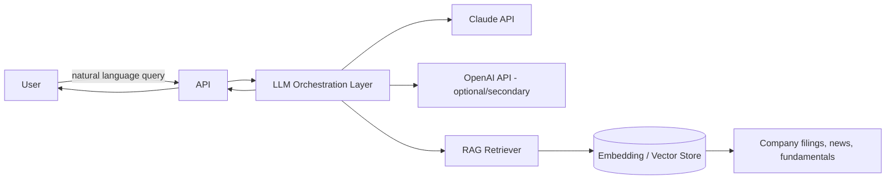

# AI Architecture

## MVP Status: No AI/ML Required

None of the 6 MVP modules depend on AI or machine learning:

- **Shariah Compliance** is rule-based — it displays the officially published SC Malaysia
  classification (via manual import, [ADR-0003](../decisions/0003-shariah-data-sourcing.md)),
  not an AI-derived judgment.
- **Fundamental/Technical Analysis** in MVP display computed ratios and standard
  indicators (deterministic formulas), not AI-generated commentary or scores.

This is deliberate: no Claude or OpenAI API key is provisioned yet (Dependency D2 in
[assumptions-dependencies-risks.md](../00-overview/assumptions-dependencies-risks.md)),
so building AI-dependent features now would be speculative and undeployable.

## Target-State AI Architecture (Phase 2+, Blocked on D2)

Documented here for continuity so the eventual build doesn't start from zero, but **none
of this is built in MVP**.

### Planned Phase 2+ AI Capabilities (Roadmap)

- **AI Fundamental Analysis** — business summary, moat, risks, bull/bear/neutral case
  generation from structured fundamental data.
- **AI Technical Analysis** — pattern recognition (breakout, flags, head & shoulders,
  etc.), entry/target/stop-loss suggestions with confidence scores.
- **AI News Intelligence** — summarization and impact scoring of aggregated news.
- **AI Research Assistant** — natural-language Q&A over the platform's data via
  retrieval-augmented generation (RAG), backed by an embedding/vector store.
- **AI Recommendation Engine** — combining fundamental/technical/macro/risk scores into
  Buy/Hold/Sell-style guidance with explicit reasoning.

### Design Principles for When This Is Built

- **Explainability**: every AI output must cite the underlying data it drew from (per the
  platform's education/research positioning and BR6 — AI content must be clearly labeled
  as analysis, not investment advice).
- **Attribution**: RAG responses should reference source documents/data points, not
  present synthesized claims as unsourced fact.
- **Provider abstraction**: the orchestration layer should not hard-code a single LLM
  vendor, given the spec calls for both Claude and OpenAI support — allows provider
  fallback/comparison.

## Prerequisite Before Any AI Work Begins

Resolve Dependency D2 (Claude and/or OpenAI API access) and define a budget/usage model —
neither exists today.
