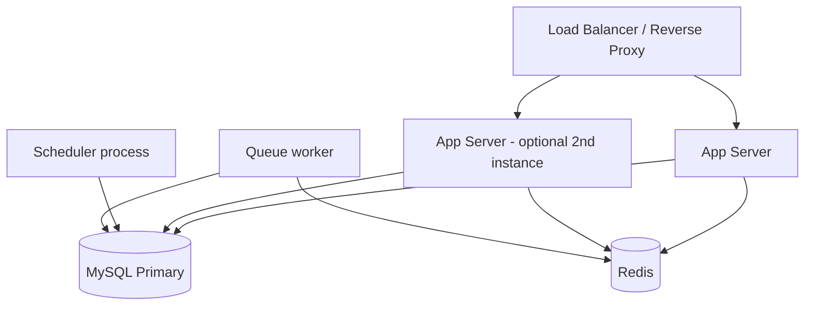

# Infrastructure Architecture

Written **cloud-agnostic** since no hosting provider is selected yet
([ADR-0008](../decisions/0008-hosting-provider.md), Dependency D4). Describes required
capabilities, not provider-specific services.

## Environments

| Environment | Purpose |
|---|---|
| Local (development) | Docker Compose or equivalent: PHP 8.4, MySQL/MariaDB, Redis, Node for frontend build. |
| Staging | Mirrors production topology at smaller scale; used for pre-release verification. |
| Production | Single-region deployment for MVP (per [System Architecture](system-architecture.md)). |

## Required Infrastructure Capabilities (MVP)

| Capability | MVP Requirement |
|---|---|
| Compute | Runs PHP 8.4/Laravel app + Vue SPA static assets; horizontally scalable app tier (stateless, sessions in Redis/DB). |
| Relational Database | MySQL/MariaDB-compatible, sized for ~1,800 securities' worth of price/fundamental history (see [ADR-0007](../decisions/0007-timeseries-storage.md)). |
| Cache / Queue Backend | Redis-compatible, for caching and Laravel Queue (Shariah import processing). |
| Scheduled Jobs | Cron-equivalent capability to run Laravel Scheduler (EOD ingestion). |
| Object/File Storage | For Shariah CSV/Excel uploads (temporary processing storage). |
| TLS/HTTPS | Certificate management for encrypted traffic (NFR-SEC2). |
| Backups | Automated database backups; retention policy TBD alongside PDPA data-retention decisions. |

## Deployment Topology (MVP)

Single primary database instance is sufficient at MVP scale — no read replicas, no
multi-region failover required yet (per [NFR §2 Availability](../01-requirements/non-functional-requirements.md#2-availability)).

## Data Residency Consideration

PDPA (Malaysia) compliance may favor hosting user data within Malaysia or a jurisdiction
with adequate data-protection recognition — this should factor into the eventual
[ADR-0008](../decisions/0008-hosting-provider.md) provider decision, alongside cost and
team familiarity. Not resolved in this document.

## Explicitly Deferred (Roadmap)

Multi-region deployment, CDN edge distribution, container orchestration (Kubernetes),
auto-scaling policies, disaster-recovery/multi-region failover, infrastructure-as-code
tooling selection (Terraform/Pulumi/etc. — deferred to the DevOps/CI-CD build phase, not
this documentation phase).
