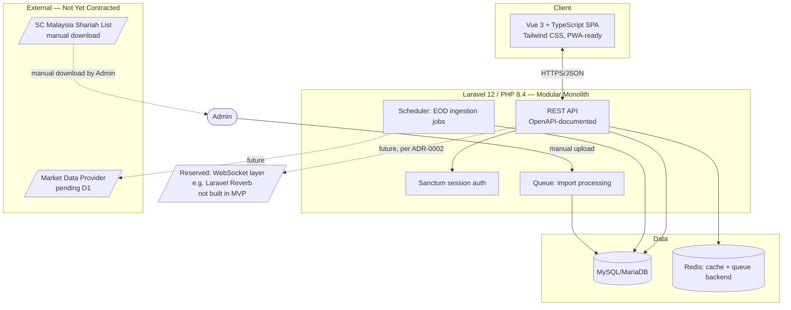

# System Architecture

Scope: MVP. See related ADRs: [0002](../decisions/0002-realtime-delivery-mechanism.md),
[0004](../decisions/0004-auth-approach.md), [0005](../decisions/0005-rest-vs-graphql.md),
[0006](../decisions/0006-repo-structure.md).

## High-Level Diagram

## Components

| Component | Technology | Notes |
|---|---|---|
| Frontend | Vue 3 + TypeScript + Tailwind CSS | Single-page app, responsive (desktop + mobile web). PWA/native app packaging is roadmap. |
| Backend | Laravel 12, PHP 8.4 | Modular monolith — see [Application/Service Design](application-service-design.md). |
| API | REST, OpenAPI-documented | Per [ADR-0005](../decisions/0005-rest-vs-graphql.md). |
| Auth | Laravel Sanctum (SPA session mode) | Per [ADR-0004](../decisions/0004-auth-approach.md). |
| Database | MySQL/MariaDB | Schema per [database-schema.md](../03-data-design/database-schema.md). |
| Cache | Redis | Caches dashboard aggregates, company lookups. |
| Queue | Redis-backed Laravel Queue | Processes Shariah CSV/Excel import jobs asynchronously. |
| Scheduler | Laravel Scheduler | Drives batch/EOD data ingestion per [ADR-0002](../decisions/0002-realtime-delivery-mechanism.md). |

## Data Ingestion (Pending Dependency D1)

No market data provider is contracted yet. The ingestion job is designed as a swappable
interface: a scheduled command fetches from a data source and upserts into `price_data`/
`fundamental_data`/`companies`. Until D1 is resolved, this may run against a manually
seeded dataset for demonstration. When a real provider is contracted, only the fetch
implementation changes — schema, API, and frontend are unaffected.

## Deployment Topology (High Level)

Single-region deployment: web/app servers (stateless, horizontally scalable), one primary
MySQL instance, one Redis instance, a scheduler/queue worker process. Exact provider is
TBD ([ADR-0008](../decisions/0008-hosting-provider.md)) — see
[Infrastructure Architecture](infrastructure-architecture.md) for the cloud-agnostic
capability list.

## What's Explicitly Not Built in MVP

WebSocket/real-time push layer (reserved per ADR-0002), microservices decomposition (see
[Application/Service Design](application-service-design.md)), multi-region deployment,
message bus/event streaming, AI service integration (see [AI Architecture](ai-architecture.md)).
